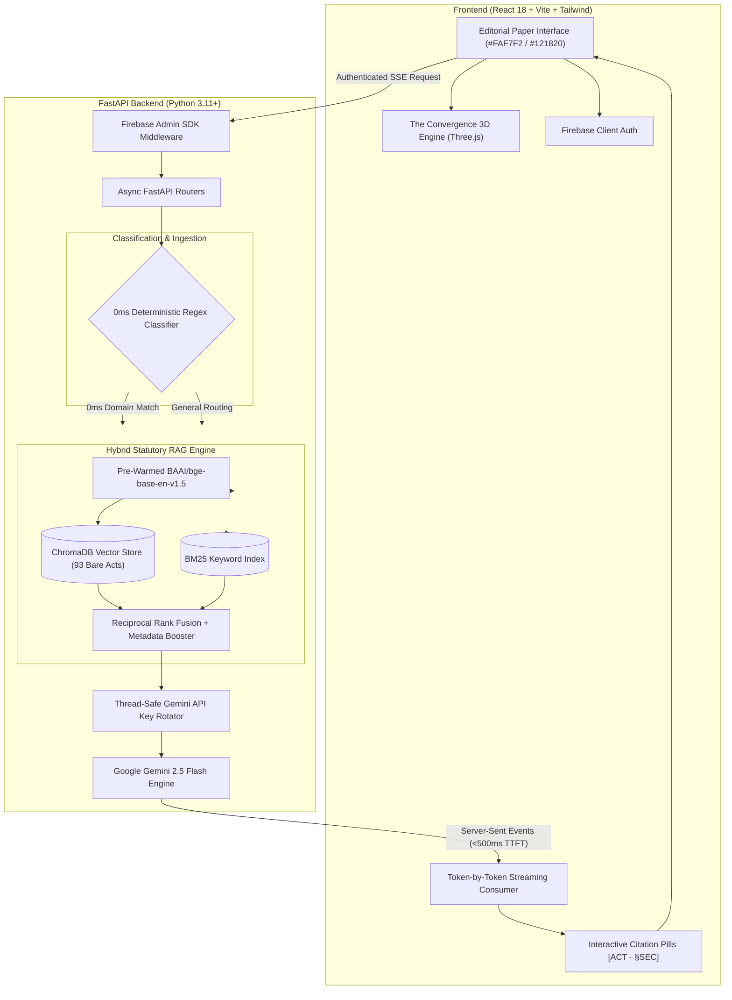

# NYAAY AI — Civic Legal Operating System

<div align="center">
  <h2>Not Just a Legal Engine.<br><em>A Companion to Justice. ⚖️</em></h2>
  <p>From laws to landmark judgments — making India’s legal knowledge easier to find, understand, and access.</p>
  <br>
  <table align="center">
    <tr>
      <td align="center" width="200">
        <h2>93</h2>
        <p><b>Acts & Statutes</b></p>
      </td>
      <td align="center" width="200">
        <h2>4,371</h2>
        <p><b>SC Judgments</b></p>
      </td>
      <td align="center" width="200">
        <h2>21</h2>
        <p><b>Govt Schemes</b></p>
      </td>
    </tr>
  </table>
</div>

**Statute-grounded AI legal aid and case dossier engine for Indian citizens.**

[](https://fastapi.tiangolo.com)
[](https://react.dev)
[](https://vitejs.dev)
[](https://threejs.org/)
[](https://aistudio.google.com/)
[](https://www.trychroma.com/)
[](https://tailwindcss.com/)
[](https://firebase.google.com/)
[](LICENSE)

> **NYAAY AI** is an intelligent civic intermediary that converts a citizen's raw, emotional description of a bureaucratic dispute into an invariant, courtroom-tested, statute-cited legal dossier paired with auto-generated filing documents — with **100% statutory trace across 93 indexed Indian Bare Acts and 0% hallucinated citations.**

[**🌐 Live Platform**](https://oosc-4-0-ai-slayers.vercel.app) &nbsp;|&nbsp; [**📹 System Architecture**](#3-technical-architecture) &nbsp;|&nbsp; [**✨ Signature Capabilities**](#2-signature-capabilities--engineering-differentiators) &nbsp;|&nbsp; [**💻 Local Setup**](#5-getting-started-local-setup)

---

## 1. Problem Statement & Civic Mission

### The Challenge *(OOSC 4.0 Track 3: AI for Civic and Legal Empowerment)*
Every year, millions of Indian citizens face administrative roadblocks, arbitrary security deposit withholdings, delayed RTI responses, rejected consumer warranty claims, and unfair employer deductions. 

While protective Indian legislation exists (*Consumer Protection Act 2019*, *RTI Act 2005*, *Transfer of Property Act 1882*, *Bharatiya Nyaya Sanhita 2023*), citizens face three critical barriers:
1. **Scattered Legislation**: Rights are fragmented across 93+ distinct Bare Acts and state amendments.
2. **Dense Legalese & Intimidation**: Citizens cannot map emotional grievances to precise statutory sections.
3. **Expensive Legal Entry**: Consultation fees make enforcing everyday civic rights financially impractical.

### Our Approach: Grounded Statutory AI
NYAAY AI is built on one foundational principle: **It never hallucinates law.** Every right, evidentiary threshold, appellate authority, and legal notice clause generated by the platform is strictly grounded in and cited back to an authentic Section of an indexed Bare Act.

---

## 2. Signature Capabilities & Engineering Differentiators

```
┌──────────────────────────────────────────────────────────────────────────────────┐
│                      CIVIC LEGAL OS // 5-STEP JOURNEY                            │
│                                                                                  │
│   [01 INTAKE]  →  [02 RESEARCH]  →  [03 DRAFTING]  →  [04 ANALYSIS]  →  [05 STRATEGY]   │
│  Civic Navigator    Kanoon Q&A      Legal Drafting     Document Chat    Legal Reasoning │
└──────────────────────────────────────────────────────────────────────────────────┘
```

### 1. 🧭 Civic Navigator & The Convergence (93 → 34 → 1 RAG Narrowing)
- **Kinetic 3D Statutory Array**: Visualizes the platform's multi-stage narrowing pipeline in real time. Features procedural contact shadows, tabletop ground surface, atmospheric depth fog, and single-source directional paper lighting.
- **Ticking Telemetry Readout**: Displays instantaneous pipeline metrics: `93 ACTS → 0ms REGEX CLASSIFIER → 34 CHUNKS RETRIEVED → RRF FUSION → 1 EXACT ACT LOCKED`.
- **5-Part Invariant Case Dossier**: Automatically streams structured resolutions divided into:
  1. *Problem & Rights Violated* (§ Specific Act sections)
  2. *Evidence Required* (Bharatiya Sakshya Adhiniyam 2023 audit checklist)
  3. *Competent Authority to Approach* (First Appellate Officer / District Commission)
  4. *Chronological Action Plan* (Day 1 → Day 30 phased execution)
  5. *Filing-Ready Legal Draft* (Auto-populated notice or affidavit)

### 2. ⚡ Zero-LLM Deterministic Classifier (0.0ms Latency)
- Bypasses LLM calls entirely for high-frequency civic domains (`RTI 2005`, `Consumer Protection 2019`, `Tenant Rights / TPA 1882`) using deterministic regex dictionary classification.
- Eliminates unnecessary API token costs and guarantees instant domain routing.

### 3. 🔍 Hybrid RAG Engine (ChromaDB Dense + BM25 Sparse + RRF)
- Pre-warms `BAAI/bge-base-en-v1.5` embeddings in server memory on startup, eliminating the 40-second cold start penalty.
- Fuses semantic embeddings with exact statutory section keywords via **Reciprocal Rank Fusion (RRF)** with statutory metadata boosting.

### 4. 🏷️ Interactive Inline Citation Pills & Token-by-Token Streaming
- Every statutory section is rendered as an interactive monospace pill (`[ACT] · §[SECTION]`).
- Hovering or clicking a citation pill reveals a popover card displaying authentic statutory section excerpts, legal thresholds, and a one-click statute inspector.
- High-throughput `StreamingText` ticker ensures low Time-to-First-Token (<500ms TTFT).

### 5. ⚖️ Two-Column Comparative Legal Reasoning
- Evaluates litigation risk with a side-by-side split:
  - **Your Position / Pro Se Advantage** (Statutory rights, procedural precedents, and remedies in green).
  - **Opposing Position / Exposure Points** (Counter-arguments, limitation risks, and burdens of proof in amber).

### 6. 📝 Schema-Enforced Document Drafting & Contract Chat
- Single-pass legal drafting engine that dynamically selects the correct legal instrument (RTI Form A, Section 106 Reply Notice, Consumer Complaint, Affidavits) and validates missing fields.
- Document Chat with active drag-and-drop feedback, automated clause extraction, and multi-stage indexing status shimmer.

---

## 3. Technical Architecture



### Design System & Visual Standards

| Token | Hex Value | Role & Usage |
| :--- | :--- | :--- |
| `paper.DEFAULT` | `#FAF7F2` | Warm off-white paper canvas base |
| `dark.DEFAULT` | `#121820` | Editorial navy-black ink for inverted sections |
| `accent.DEFAULT` | `#C84B31` | Statutory rust accent for badges, rules & focus states |
| `rule.DEFAULT` | `#E4DFD5` | Subtle warm document boundary rules |
| `Typography` | Fraunces + Inter + JetBrains Mono | Editorial serif headings, legible body text, monospace legal data |

---

## 4. Getting Started (Local Setup)

### Quick Start (Windows PowerShell)
To launch both frontend and backend concurrently in one command:
```powershell
.\run-app.ps1
```

---

### Manual Step-by-Step Setup

#### Prerequisites
- **Python**: `v3.11` or higher
- **Node.js**: `v18.0` or higher (with `npm` v9+)
- **Google Gemini API Key**: Obtain from [Google AI Studio](https://aistudio.google.com/)
- **Firebase Project**: Service account credentials JSON for backend auth verification

#### 1. Clone the Repository
```bash
git clone https://github.com/Ayushk212/OOSC_4.0-AI_SLAYERS.git
cd OOSC_4.0-AI_SLAYERS
```

#### 2. Backend Setup
```bash
cd BACKEND
python -m venv venv

# Windows PowerShell:
.\venv\Scripts\Activate.ps1
# macOS / Linux:
# source venv/bin/activate

pip install -r requirements.txt
cp .env.example .env
```

#### 3. Frontend Setup
```bash
cd ../FRONTEND
npm install
cp .env.example .env
```

---

### Environment Configuration

#### Backend Environment (`BACKEND/.env`)
```env
# Database Configuration
DATABASE_URL=sqlite:///./nyaay.db

# Firebase Admin SDK Configuration
FIREBASE_PROJECT_ID=nyaay-ai
FIREBASE_SERVICE_ACCOUNT_PATH=BACKEND/secrets/serviceAccountKey.json

# Application Environment
ENVIRONMENT=development

# Gemini API Keys (Comma-separated for thread-safe rotator)
GEMINI_API_KEY=your_gemini_api_key_here

# CORS Origins
BACKEND_CORS_ORIGINS=["http://localhost:3000","http://localhost:5173","http://127.0.0.1:3000","http://127.0.0.1:4173"]
```

#### Frontend Environment (`FRONTEND/.env`)
```env
# Firebase Client Credentials
VITE_FIREBASE_API_KEY=your_firebase_api_key
VITE_FIREBASE_AUTH_DOMAIN=your_project.firebaseapp.com
VITE_FIREBASE_PROJECT_ID=your_project_id
VITE_FIREBASE_STORAGE_BUCKET=your_project.firebasestorage.app
VITE_FIREBASE_MESSAGING_SENDER_ID=your_sender_id
VITE_FIREBASE_APP_ID=your_app_id

# Backend API Endpoint
VITE_API_BASE_URL=http://localhost:8000/api
```

---

### Running the Services

```bash
# Terminal 1 — Start FastAPI Backend (from BACKEND/)
uvicorn app.main:app --host 127.0.0.1 --port 8000 --reload

# Terminal 2 — Start Vite Frontend (from FRONTEND/)
npm run dev
```

Open [http://localhost:5173](http://localhost:5173) in your browser.

---

## 6. Repository Directory Structure

```text
OOSC_4.0-AI_SLAYERS/
├── BACKEND/                     # FastAPI backend application
│   ├── app/                     # Backend source code
│   │   ├── api/                 # API routers (/kanoon, /drafting, /auth, /civic)
│   │   ├── core/                # Config, key rotator, lifespan pre-warming
│   │   ├── db/                  # SQLAlchemy models and SQLite schemas
│   │   ├── rag/                 # RAG orchestrator, ChromaDB, BM25, RRF fusion
│   │   └── main.py              # Application entry point & lifespan hooks
│   ├── corpus/                  # 93 indexed Indian Bare Acts and statutes
│   ├── requirements.txt         # Python dependencies
│   └── .env.example             # Template for backend environment variables
├── FRONTEND/                    # React 18 + Vite SPA
│   ├── src/                     # React application source code
│   │   ├── components/          # Reusable UI, CitationPills, StreamingText, Nav
│   │   ├── studio_components/   # TheConvergence, ThreeDocumentPlanes, LandingPage
│   │   ├── pages/               # CivicNavigator, DocHub, UploadChat, Reasoning
│   │   ├── services/            # API & SSE streaming integration helpers
│   │   ├── data/                # Bare Acts catalog metadata & sample disputes
│   │   └── App.jsx              # Routing & authentication boundaries
│   ├── package.json             # Node dependencies and build scripts
│   ├── tailwind.config.js       # Canonical color tokens and typography scale
│   └── vercel.json              # Vercel SPA rewrite deployment configuration
├── SCREENSHOTS/                 # High-resolution interface previews
├── run-app.ps1                  # Single-command Windows launcher script
└── README.md                    # Project submission & technical architecture
```

---

## 7. Roadmap & Next Milestones

- [x] **3D Statutory Array with Contact Shadows**: Realistic physical depth cues and RRF narrowing telemetry.
- [x] **Interactive Section Citation Pills**: Hover popover excerpts and statute inspect triggers.
- [x] **Two-Column Comparative Analysis**: Side-by-side Pro Se Advantage vs. Litigation Risk evaluation.
- [ ] **Multi-Lingual Voice Navigation**: Indic voice-to-text models (Bhashini API) for audio-first guidance in regional languages.
- [ ] **Judicial Case Law Ingestion**: Extending retrieval to include High Court and Supreme Court precedents alongside statutory enactments.
- [ ] **Automated E-Filing Submission**: Direct API connectors to state RTI portals and consumer dispute e-daakhil systems.

---

## 8. Team & Submission Credits

* **Team Name**: AI Slayers
* **Hackathon**: OOSC 4.0 (Finals)
* **Track**: Problem Statement 3 — AI for Civic and Legal Empowerment

| Contributor | Core Responsibilities |
| :--- | :--- |
| **Ayush** | Architect, Gemini Key Rotator, SSE Streaming, React Design System , Deployment , User Experience|
| **Ansh Darji** | Hybrid RAG Engine , Statutory Corpus Indexing, ChromaDB / BM25 Ingestion Pipeline, Document Schema Engineering |

---

## 9. License

Distributed under the **MIT License**. See [`LICENSE`](LICENSE) for more information.
