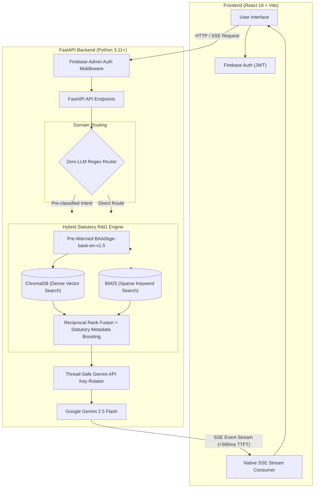

# NYAAY AI — Civic & Legal Empowerment Platform

**Legal rights, translated into citizen action.**

[](https://fastapi.tiangolo.com)
[](https://react.dev)
[](https://vitejs.dev)
[](https://aistudio.google.com/)
[](https://www.trychroma.com/)
[](https://oosc-4-0-ai-slayers.vercel.app)
[](https://firebase.google.com/)
[](LICENSE)

> NYAAY AI acts as an intelligent intermediary between complex Indian statutes and everyday citizens, converting intimidating legal rights into structured, step-by-step resolution dossiers and auto-generated legal documents.

[**🌐 Live Demo**](https://oosc-4-0-ai-slayers.vercel.app) &nbsp;|&nbsp; [**📹 Demo Video (≤10 min)**](#5-live-demo--screenshots) &nbsp;|&nbsp; [**📖 Documentation**](#4-architecture) &nbsp;|&nbsp; [**🐛 Report Bug**](https://github.com/Ayushk212/OOSC_4.0-AI_SLAYERS/issues)

---

## 1. Problem Framing & Our Approach

### The Challenge
**Hackathon Track 3: AI for Civic and Legal Empowerment** *(Theme: Civic Tech, Legal Access, and Government Transparency)*

In India, citizens regularly face procedural delays, withheld security deposits, defective consumer goods, and unfulfilled administrative requests. While protective laws exist (such as the *Consumer Protection Act 2019*, *Right to Information Act 2005*, and state *Rent Control Acts*), legal language is dense, remedies are scattered across disparate portals, and formal legal consultation is prohibitively expensive for everyday grievances. As a result, millions of enforceable rights go unexercised.

### Our Approach
NYAAY AI transforms static legal information into dynamic citizen execution. Rather than serving as a generic open-ended legal chatbot prone to dynamic URL hallucinations, NYAAY AI combines deterministic intent classification with a hybrid statutory RAG pipeline. It outputs structured, low-latency civic action plans paired with single-pass legal document generation—empowering citizens from initial grievance to formal filing.

---

## 2. Key Feature Showcase

| Feature | Engineering & Performance Highlight | Visual Preview |
| :--- | :--- | :--- |
| **🧭 Civic Navigator** | **Real-Time Structured Dossiers**<br>Delivers a 5-part actionable breakdown via Server-Sent Events (SSE) streaming with a Time-to-First-Token (TTFT) under 500ms.<br>• *Problem & Rights Violated*<br>• *Evidence Required (Checklist)*<br>• *Relevant Authority to Approach*<br>• *Chronological Action Plan*<br>• *Recommended Legal Drafts* | `[Civic Navigator UI]` |
| **⚡ Zero-LLM Router** | **Engineering Differentiator: 0.0ms Overhead**<br>Bypasses LLM calls entirely for high-frequency query domains (`RTI`, `Consumer Protection`, `Tenant Rights`) using deterministic regex dictionary matching. Eliminates unnecessary API latency and preserves quota for RAG synthesis. | `[Regex Classifier]` |
| **📝 Single-Pass Legal Drafting** | **Optimized Generative Pipeline**<br>Injects document schemas, mandatory fields, and user facts into a single LLM prompt pass. Simultaneously identifies document type (Affidavits, Legal Notices, RTI Applications), flags missing user inputs, and outputs structured JSON drafts. | `[Document Generator]` |
| **🚀 Pre-Warmed Lifespan Models** | **Latency Optimization**<br>Loads `SentenceTransformer` dense embeddings (`BAAI/bge-base-en-v1.5`) directly into memory during FastAPI server startup lifespan hooks. Completely eliminates the 40-second cold-start penalty on initial user requests. | `[Lifespan Pre-warming]` |

---

## 3. Architecture



### Technical Implementation Decisions

| Component | Technology | Selection Rationale |
| :--- | :--- | :--- |
| **Frontend Framework** | React 18 + Vite | Fast HMR build pipeline with native ES module support; lightweight rendering footprint for complex dynamic forms. |
| **Styling & Motion** | Tailwind CSS + Framer Motion | Provides utility-first styling with micro-interactions for high visual polish and responsive layouts. |
| **Backend Framework** | FastAPI + Uvicorn | Async Python framework featuring native support for Server-Sent Events (SSE) and fast request serialization. |
| **LLM Engine** | Google Gemini 2.5 Flash | High context throughput with sub-second generation speed; integrated with custom thread-safe key rotation for rate-limit resilience. |
| **Dense Vector Search** | ChromaDB + `BAAI/bge-base-en-v1.5` | Top-ranking open-weight embeddings optimized for retrieval quality across legal statutes and structured context. |
| **Sparse Search** | `rank-bm25` | Exact keyword matching for legal terminology, section numbers, and specific act titles. |
| **Hybrid Retrieval** | Reciprocal Rank Fusion (RRF) | Merges dense semantics and sparse terms with custom statutory metadata weights, preventing retrieval omissions. |
| **State & Storage** | SQLite + SQLAlchemy | Lightweight persistent session storage, chat history tracking, and execution metrics without external database server overhead. |

---

## 4. Live Demo & Screenshots

> **🌐 Hosted Application**: [https://oosc-4-0-ai-slayers.vercel.app](https://oosc-4-0-ai-slayers.vercel.app)

### Demo Video
* **Video Link**: [Watch NYAAY AI Demo Video](https://github.com/Ayushk212/OOSC_4.0-AI_SLAYERS) *(Length: < 10 minutes)*
* **Walkthrough Highlights**: Covers RTI grievance mapping, Consumer Protection warranty notice generation, and instant legal document drafting.

### Core Interface Screenshots

| 01. Landing Hero & 3D Statutory Array | 02. Live Sub-500ms TTFT Streaming Proof |
| :---: | :---: |
|  |  |
| *Citizen-legible interface with 3D statutory convergence* | *Real-time regex routing, hybrid RRF retrieval & live dossier streaming* |

| 03. Four Core Pillars of Legal Aid | 04. Five-Part Case Dossier Standard |
| :---: | :---: |
|  |  |
| *RTI, Rights Navigator, Welfare Reader & Form-Filler* | *Courtroom-tested invariant output shape* |

| 05. Common Civic Scenarios Carousel | 06. 93 Indian Bare Acts Knowledge Base |
| :---: | :---: |
|  |  |
| *Real-world benchmark scenarios across RTI, Tenant, Consumer* | *Full statutory repository with section-level grounding* |

| 07. Civic Navigator Streaming Dossier | 08. Evidentiary Threshold & BSA 2023 Checklist |
| :---: | :---: |
|  |  |
| *Structured legal analysis from plain Hindi / English queries* | *Audit-readiness verification before any tribunal or court* |

| 09. Day 1 → Day 30 Phased Action Plan | 10. Scheme Eligibility & Benefit Calculator |
| :---: | :---: |
|  |  |
| *Limitation Act 1963 compliant milestone stepper* | *Welfare entitlement verification with document checklist* |

| 11. Conversational Form-Filler & Legal Notice Drafter |
| :---: |
|  |
| *Bilingual intake engine with real-time official legal form generation* |

---

## 5. Getting Started (Local Setup)

### Quick Start
To launch both frontend and backend on Windows in one command:
```powershell
.\run-app.ps1
```
*(Or follow the manual step-by-step setup below)*

---

### Prerequisites
- **Python**: `v3.11` or higher
- **Node.js**: `v18.0` or higher (with `npm` v9+)
- **Google Gemini API Key**: Obtain from [Google AI Studio](https://aistudio.google.com/)
- **Firebase Project**: Service account credentials JSON for backend verification

---

### Step-by-Step Setup

#### 1. Clone Repository
```bash
git clone https://github.com/Ayushk212/OOSC_4.0-AI_SLAYERS.git
cd OOSC_4.0-AI_SLAYERS
```

#### 2. Backend Setup
```bash
cd BACKEND
python -m venv venv

# Windows PowerShell:
.\venv\Scripts\Activate.ps1
# macOS / Linux:
# source venv/bin/activate

pip install -r requirements.txt
cp .env.example .env
```

#### 3. Frontend Setup
```bash
cd ../FRONTEND
npm install
cp .env.example .env
```

---

### Environment Variables Configuration

#### Backend Environment Variables (`BACKEND/.env`)
```env
# Database Configuration
DATABASE_URL=sqlite:///./nyaay.db

# Firebase Admin SDK Configuration
FIREBASE_PROJECT_ID=nyaay-ai
FIREBASE_SERVICE_ACCOUNT_PATH=BACKEND/secrets/serviceAccountKey.json

# Application Settings
ENVIRONMENT=development

# Gemini API Keys (Comma-separated for thread-safe rotator)
GEMINI_API_KEY=your_gemini_api_key_here

# CORS Settings
BACKEND_CORS_ORIGINS=["http://localhost:3000","http://localhost:5173","http://127.0.0.1:3000","http://127.0.0.1:5173"]
```

#### Frontend Environment Variables (`FRONTEND/.env`)
```env
# Firebase Client Credentials
VITE_FIREBASE_API_KEY=your_firebase_api_key
VITE_FIREBASE_AUTH_DOMAIN=your_project.firebaseapp.com
VITE_FIREBASE_PROJECT_ID=your_project_id
VITE_FIREBASE_STORAGE_BUCKET=your_project.firebasestorage.app
VITE_FIREBASE_MESSAGING_SENDER_ID=your_sender_id
VITE_FIREBASE_APP_ID=your_app_id

# Backend API Endpoint
VITE_API_BASE_URL=http://localhost:8000/api
```

---

### 4. Running the Application

```bash
# Terminal 1 - Run Backend (from BACKEND directory)
uvicorn app.main:app --host 127.0.0.1 --port 8000 --reload

# Terminal 2 - Run Frontend (from FRONTEND directory)
npm run dev
```

Open [http://localhost:3000](http://localhost:3000) in your browser.

---

## 6. Project Structure

<details>
<summary><b>📂 Click to expand repo directory tree</b></summary>

```text
OOSC_4.0-AI_SLAYERS/
├── BACKEND/                     # FastAPI backend application
│   ├── app/                     # Main backend source code
│   │   ├── api/                 # API routers (/kanoon, /drafting, /auth)
│   │   ├── core/                # Core config, key rotator, lifespan hooks
│   │   ├── db/                  # SQLite database models and schemas
│   │   ├── rag/                 # RAG orchestrator, ChromaDB, BM25, RRF logic
│   │   └── main.py              # FastAPI application entry point
│   ├── corpus/                  # Indexed Indian Bare Acts and statutes
│   ├── requirements.txt         # Python dependency definitions
│   └── .env.example             # Template for backend environment variables
├── FRONTEND/                    # React 18 + Vite frontend application
│   ├── public/                  # Static assets and public resources
│   ├── src/                     # React components, routes, and SSE hooks
│   │   ├── components/          # Reusable UI components & Navigator screens
│   │   ├── context/             # React context state (Auth, Theme)
│   │   ├── services/            # API & SSE streaming integration helpers
│   │   └── App.jsx              # Main React application component
│   ├── package.json             # Node.js dependencies and scripts
│   ├── vercel.json              # Vercel deployment & SPA rewrite routing
│   └── .env.example             # Template for frontend environment variables
├── ASSETS/                      # Project branding and assets
├── DOCS/                        # Technical design documentation
├── SCREENSHOTS/                 # UI screenshots and previews for evaluation
├── run-app.ps1                  # Single-command PowerShell app launcher
├── docker-compose.yml           # Optional Docker orchestration configuration
└── README.md                    # Project submission documentation
```

</details>

---

## 7. Roadmap & Future Vision

- [ ] **Multi-Lingual Voice Navigation**: Integrate Indic voice-to-text models (Bhashini API) for audio-first legal guidance in regional languages.
- [ ] **Supreme Court & High Court Case Law Ingestion**: Extend RAG retrieval to include judicial precedents alongside statutory Bare Acts.
- [ ] **State Jurisdiction Auto-Detection**: Dynamically load state-specific amendments (e.g., Maharashtra Rent Control Act vs. Delhi Rent Control Act) based on citizen location.
- [ ] **E-Filing Portal Integration**: Direct API connections to government filing systems for seamless RTI application submission.

---

## 8. Team & Credits

* **Team Name**: AI Slayers
* **Hackathon Track**: Problem Statement 3 — AI for Civic and Legal Empowerment

| Member | Role | Focus Areas |
| :--- | :--- | :--- |
| **Ayush** | Lead Architect & Full Stack | FastAPI, Hybrid RAG Engine, Gemini Key Rotator, SSE Streaming, React |
| **Ansh Darji** | Core Developer | Corpus indexing, ChromaDB / BM25 fusion, UI components |

---

## 9. License

This project is open-source under the terms of the [MIT License](LICENSE).
